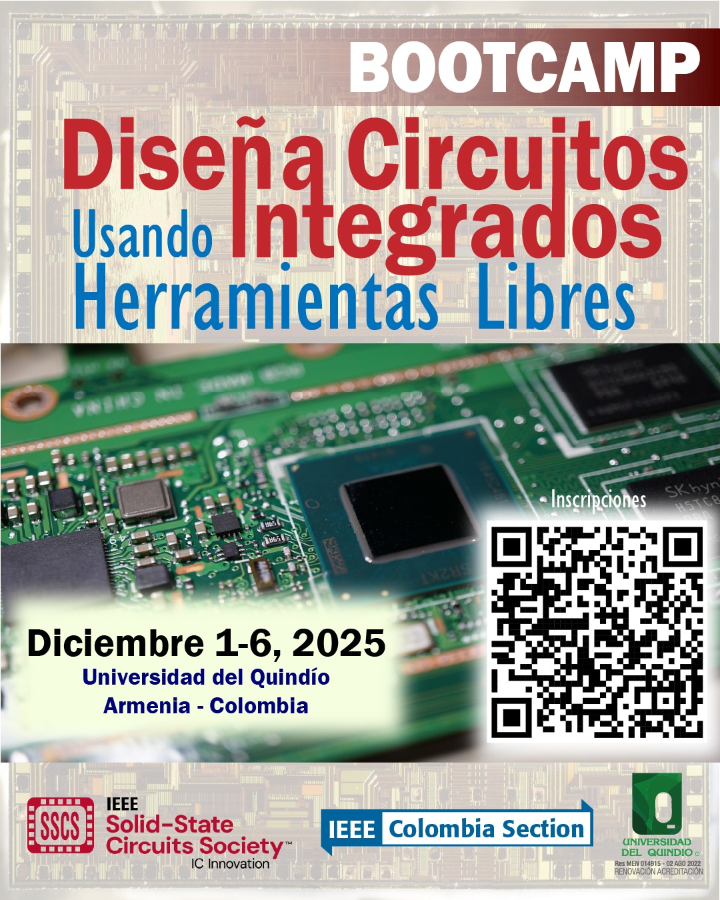

# SEED_Bootcamp_ihp

En este repositorio se eucuentran los laboratorios correspondientes al bootcamp organizado por la Universidad del Quindío, IEEE, SSCS, el programa SEED y la Red Colombiana de Electrónica y Semiconductores RedCEyS durante los días 1 de Diciembre 2025 al 6 de Diciembre 2025.

   

  
